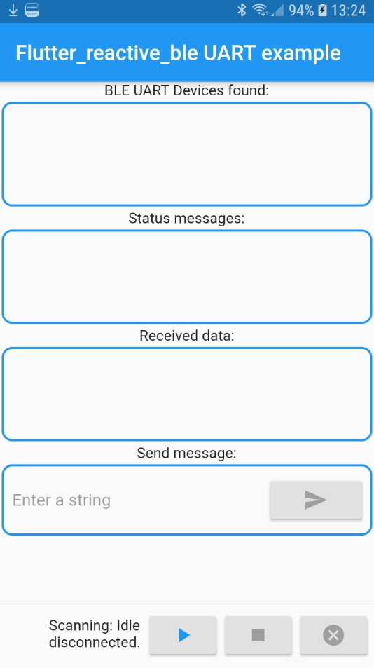

## Note

This is an updated version of the flutter_reactive_ble_uart app.

1. Newer flutter, android studio and library versions are used.
2. Use permission_handler main.dart.
3. Some minor changes in main.dart to make it non-nullable.

Everything seems to work, there is however one strange problem.
While is works when used with a Samsung tablet (Android 10) there is a problem with a Samsung S7 smartphone (Android 8).
Often, after connecting, there is a immediate disconnect.
This often with one of the following error messages:

> GenericFailure<CharacteristicValueUpdateError>(code:CharacteristicValueUpdateError.unknown, message: "Disconnected from MAC='XX:XX:XX:XX:XX:XX with status 19 (GATT_CONN_TERMINATE_PEER_USER")E7:05...  ($id)

> GenericFailure<CharacteristicValueUpdateError>(code:CharacteristicValueUpdateError.unknown, essage: "Cannot write client characteristic config descriptor (code 3) with characteristic UUID 6e4000....")E7:05...

What also is strange there seems to be a kind of switch, either there is no error for some time of this error occurs every time.
Is there something amiss with the working with Android 8?

The peripheral is an Arduino Nano BLE running the Nordic UART example.

Below the original README

# flutter reactive BLE UART demo app

This demo app shows an usecase for using flutter_reactive_ble library for building a UART emulation over BLE.

This demo app uses one service: the Nordic UART Service with vendor-specific UUID:

```dart
Uuid _UART_UUID = Uuid.parse("6E400001-B5A3-F393-E0A9-E50E24DCCA9E");
```

The aforementioned service uses two characteristics: one for transmitting and one for receiving (as seen from the peer).

```dart
Uuid _UART_RX   = Uuid.parse("6E400002-B5A3-F393-E0A9-E50E24DCCA9E");
Uuid _UART_TX   = Uuid.parse("6E400003-B5A3-F393-E0A9-E50E24DCCA9E");
```

## Usage

This app can be used if the BLE peripheral implements the aforementioned services. The user interface is shown below:



Use the play button for scanning and the stop button for stop a running scan. When an UART BLE service is found, it is displayed at the top. Press the found device at the right, then a connection is being established as can be seen in the Status messages pane. Then a message string can be sent to the BLE peripheral, Received data is shown in the Received data pane. An existing connection can be closed using the bottom rightmost button.

## BLE undeliverable exception

The BLE undeliverable exception is handled as shown in [this file.](./android/app/src/main/kotlin/nl/wolffonline/uart_ble/MainActivity.kt)

## Flutter BLE plugin

The plugin enabling BLE in Flutter can be found at https://pub.dev/packages/flutter_reactive_ble
